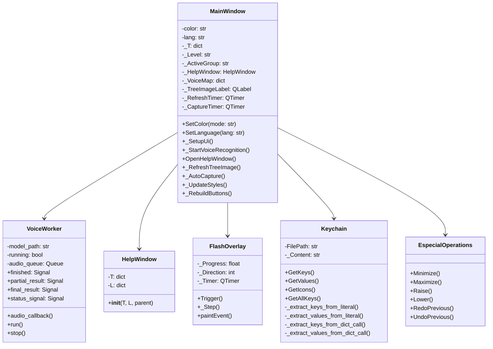
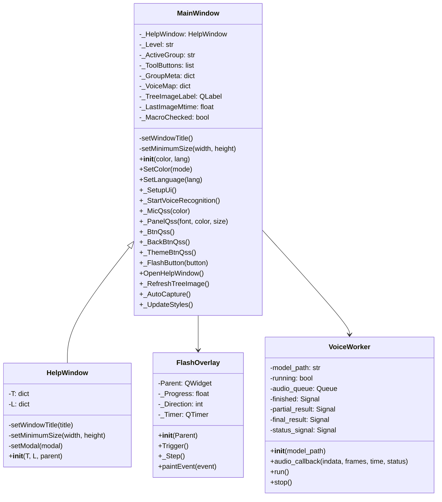
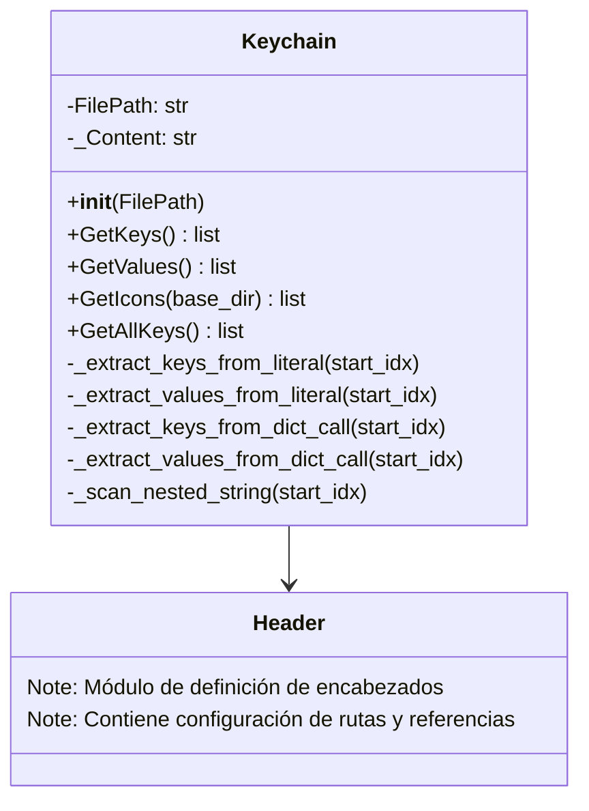
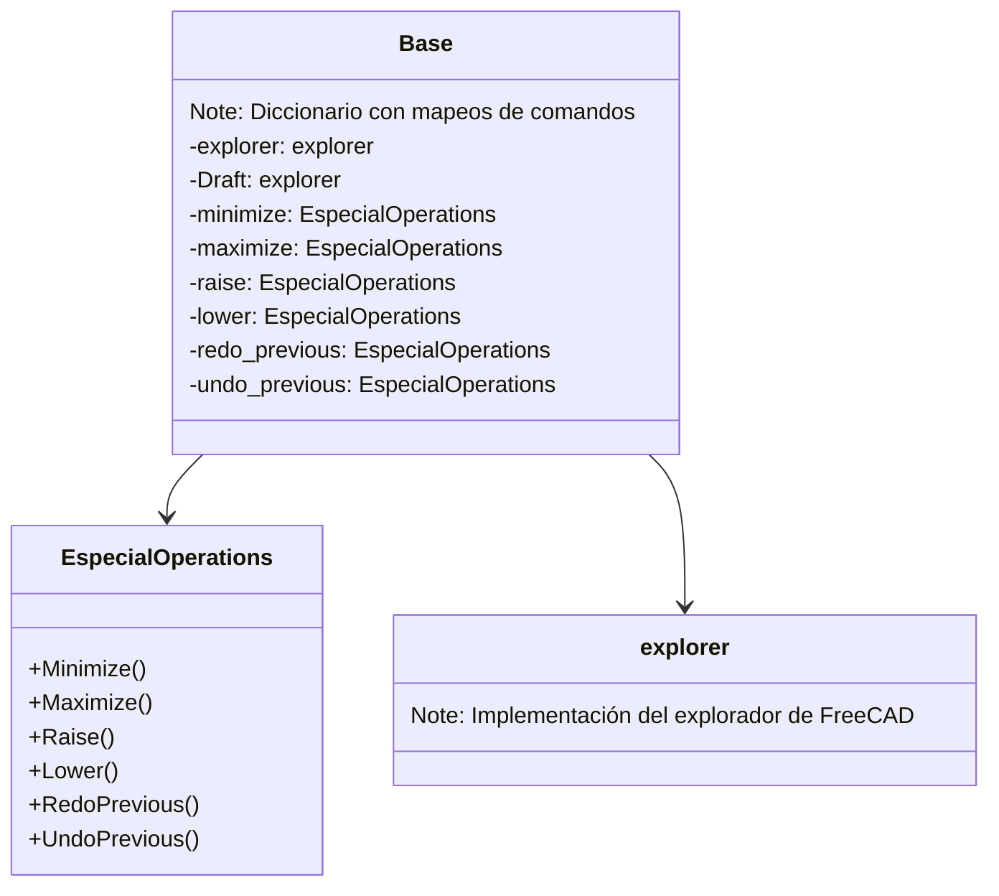
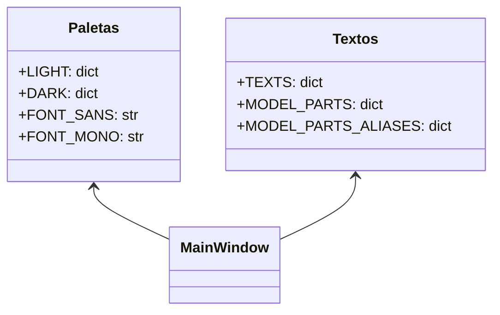
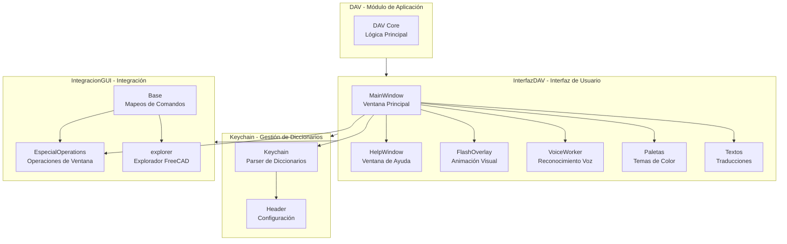
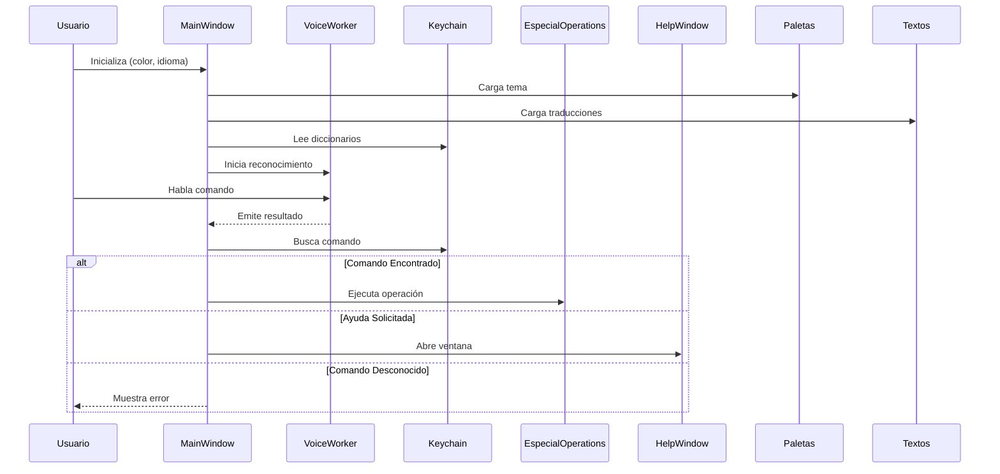

# Diagramas de Clases - ComponentesDAV

## 1. Diagrama General de Componentes

## 2. Componente InterfazDAV (Interfaz de Usuario)

## 3. Componente Keychain (Gestión de Diccionarios)

## 4. Componente IntegracionGUI (Operaciones Especiales)

## 5. Módulos de Configuración (Paletas y Textos)

## 6. Diagrama Jerárquico Completo

## 7. Flujo de Interacción Principal

## Relaciones Entre Componentes

### Dependencias
- **MainWindow**: depende de VoiceWorker, HelpWindow, FlashOverlay, Keychain, Paletas, Textos
- **VoiceWorker**: depende de Vosk (librería externa) y sounddevice
- **HelpWindow**: depende de Paletas, Textos
- **FlashOverlay**: hereda de QWidget (PySide6)
- **Keychain**: módulo independiente de análisis de texto
- **EspecialOperations**: interactúa con FreeCADGui

### Composición
- MainWindow **contiene** elementos de UI (QLabel, QPushButton, QTextEdit)
- MainWindow **utiliza** VoiceWorker para captura de audio
- MainWindow **crea** HelpWindow cuando es necesario
- MainWindow **aplica** temas de Paletas y traducciones de Textos

### Interfaces
- Paletas: proporciona diccionarios de colores (LIGHT, DARK)
- Textos: proporciona diccionarios de traducciones (es, en, pt)
- Keychain: interfaz para lectura de diccionarios Python
